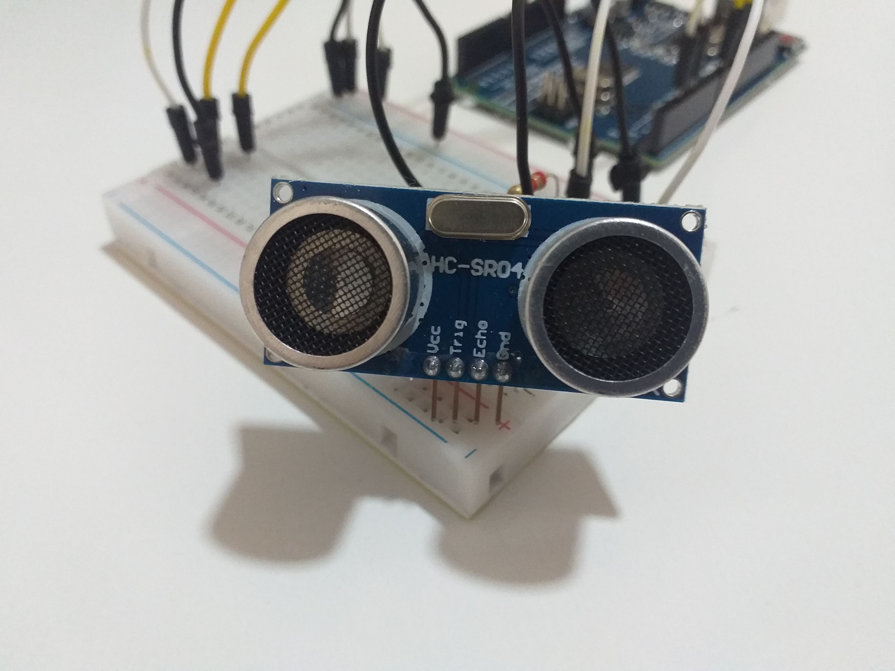
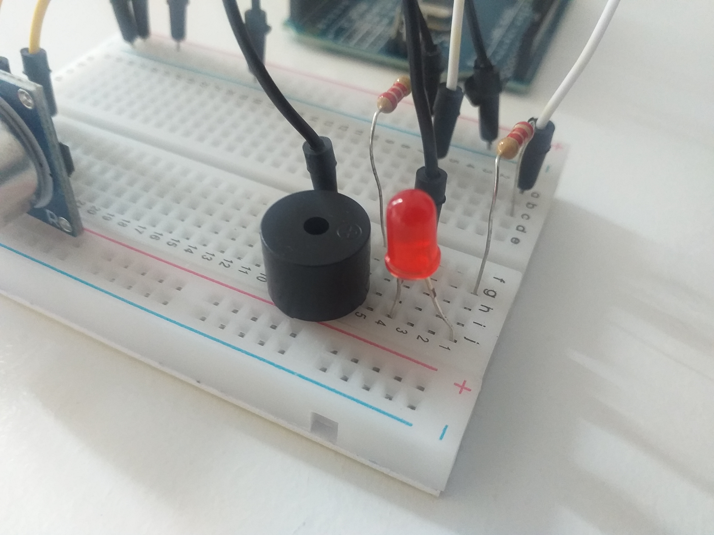
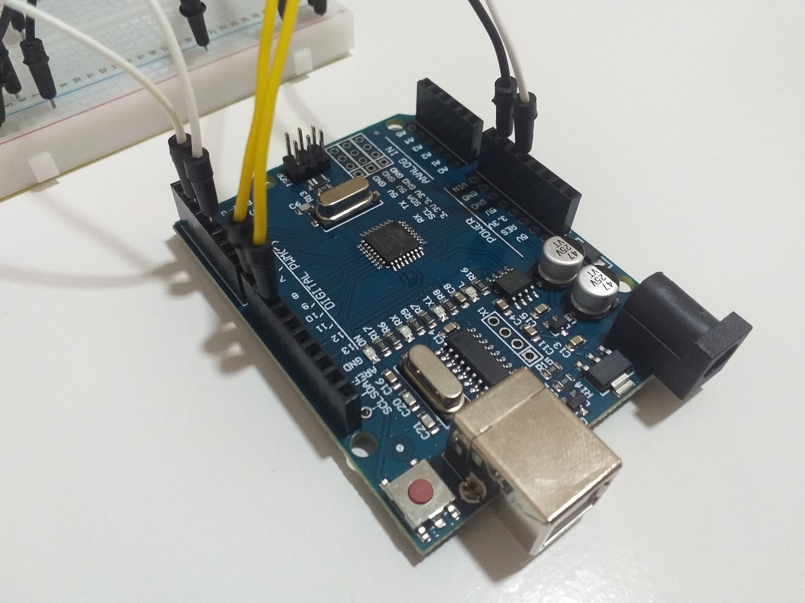
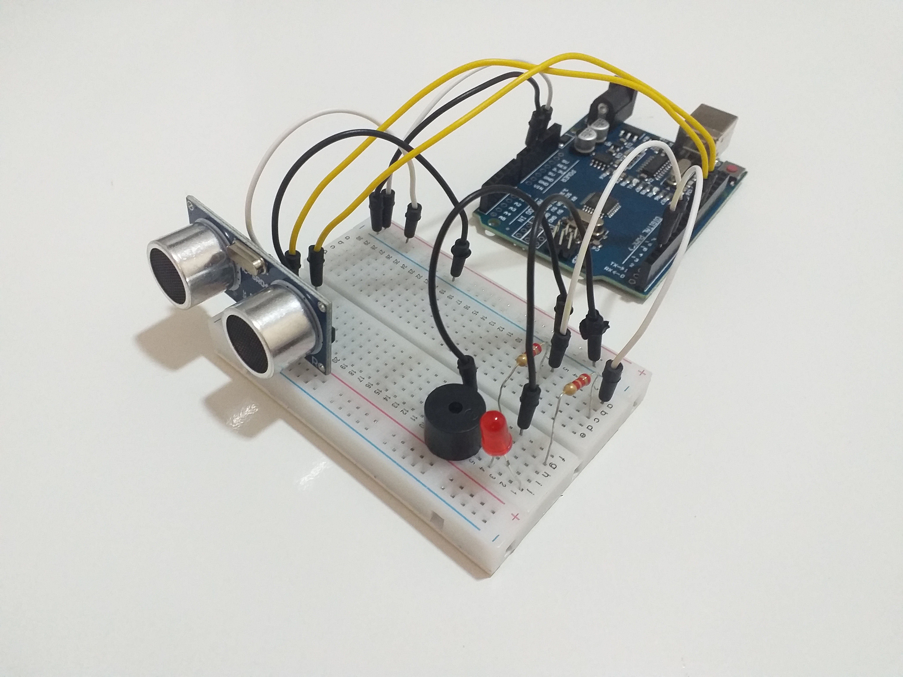
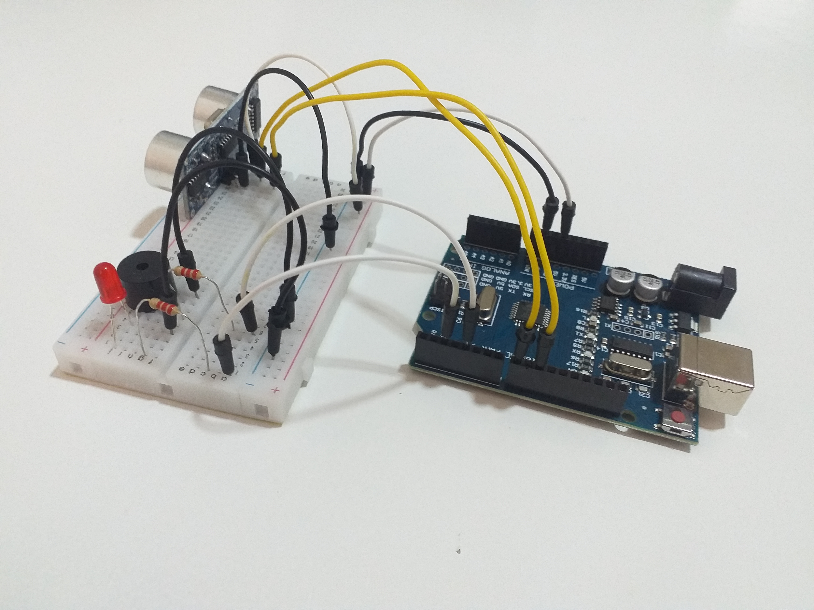

# Sensor de Estacionamento

Este projeto foi feito na matéria de Microcontroladores e IoT no 4º semestre da faculdade. Foi utilizado um Arduino, sensor ultrassônico,
LED, buzzer, alguns jumpers e um resistor. O sensor ultrassônico nos permite medir a distância de um obstáculo que está na frente do receptor. Com essa informação, é emitido sinas visuais e sonoros com o LED e o buzzer, respectivamente. Conforme a distância diminui, ou seja, o obstáculo chega mais perto do sensor (nesse caso seria um carro), os sinais ficam mais rápidos. Quando o obstáculo fica extremamente próximo, esses sinas ficam constantes por 5 segundos para avisar o motorista e parar o carro. Visto que nem todas as pessoas têm sensores nos seus carros e em muitas garagens são guardados 2 veículos, que é exatamento o meu caso, esse projeto seria um produto útil e relativamente barato para automatizar esse processo, trazer mais conforto para essas pessoas e diminuir a chance de danificar um veículo em alguma pequena batida dentro da própria garagem.

Link do vídeo https://www.youtube.com/watch?v=EOamcjagALE

## Integrante do grupo
Davi Silva Oliveira | 1810510@fmu.edu.br  
RA 1810510  
Turma BCC 191104A16

## Imagens

### Sensor ultrassônico

### LED e Buzzer

### Arduino

### Projeto montado

